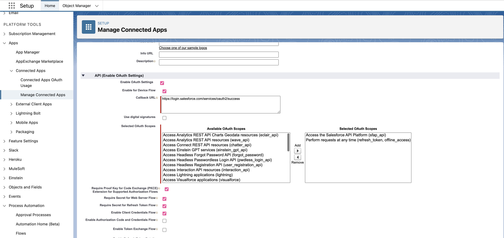
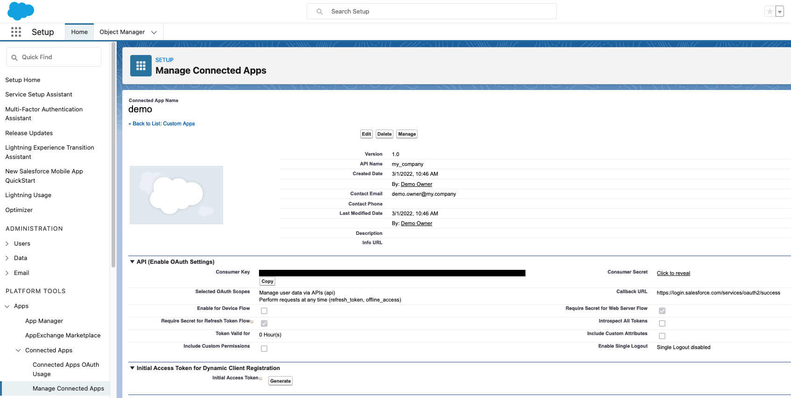

# Conduit Connector Salesforce

## General

The Salesforce plugin is one of [Conduit](https://github.com/ConduitIO/conduit) plugins.
It currently provides only source Salesforce connector, allowing for receiving Salesforce changes events in a Conduit pipeline.

## How to build it

Run `make`.

## Source

The Source connector subscribes to Salesforce platform events and queries published events in real time.

### How it works

This section describes the technical details of how the connector works.

#### PubSub API

Conduit Source Connector uses [PubSub API](https://developer.salesforce.com/docs/platform/pub-sub-api/overview) for subscribing to event data.

##### Platform Events

The connector is capable of listening to [custom Platform Events](https://developer.salesforce.com/docs/atlas.en-us.platform_events.meta/platform_events/platform_events_intro.htm). 

Platform Events in Salesforce are part of the event-driven architecture, allowing for the exchange of real-time event data between applications. They enable asynchronous communication and data transfer between Salesforce and external systems, as well as among various Salesforce components. Users can define custom Platform Events based on their specific use cases, to which the connector can subscribe. Additionally, users can subscribe to already [existing events](https://developer.salesforce.com/docs/atlas.en-us.platform_events.meta/platform_events/platform_events_objects_list.htm).

For more information on how to create Platform Events, visit the following link:  
[Creating Platform Events](https://developer.salesforce.com/docs/atlas.en-us.platform_events.meta/platform_events/platform_events_publish.htm)

###### Setting Platform Events from a Flow 

Steps to Create Platform Events

1. **Create a Platform Event**
   - Navigate to **Setup**.
   - Under **Platform Tools**, go to **Integrations** > **Platform Events**.
   - Create a new Platform Event and define all the fields for the event to match the desired data structure.

2. **Create a Flow**
   - Go to **Process Automation** > **Flow** and create a new flow.
   - Define the source of the data for the previously created event.
   - Select **Record-Triggered Flow** if you want to trigger the event based on new, updated, or deleted records on an object.
   - Apply any necessary transformations or additional data assignments within the flow.
   - End your flow with a **Create Record** element, where you will assign field values for the created event.

#### Authentication

The connector authenticates with Salesforce using OAuth credentials. Once successfully authenticated, Salesforce returns:
- `AccessToken` - token used in Streaming API requests.
- `Instance URL` - Streaming API base URL for given credentials.

##### Connected App Configuration 

1. Log in into Your Salesforce account, e.g. https://my-demo-app.my.salesforce.com. The environment is `my-demo-app`.
2. First, if not already done, You need to create connected app and enable following settings: 
    
    Under **API (Enable OAuth Settings)** 
        a. Enable `Enable OAuth Settings`
        b. For `Selected OAuth Scope` add following permissions : `Access the Salesforce API Platform` and `Perform requests at any time`. 
        c. Enable `Require Proof Key for Code Exchange (PKCE) Extension for Supported Authorization Flows` 
        d. Enable `Require Secret for Web Server Flow` 
        e. Enable `Require Secret for Refresh Token Flow` 
        c. Enable `Enable Client Credentials Flow` 

    Under **Custom Connected App Handler** 
        a. On `Run As` select a user with 'API Enabled' permission privileges. (If user doesn't have them, you can add them under Permission Sets on User settings)

    

3. Copy **Consumer Key** and **Consumer Secret**. If You need these values once again You can always find them in _Setup -> Apps -> App Manager_, find app on the list and choose _View_ option.
    

4. Once the app is created, go to _Connected Apps -> Manage Connected Apps_ and edit the application. 
    Under **Client Credentials Flow** 
        a. On `Run As` select a user with 'API Enabled' permission privileges. (If user doesn't have them, you can add them under Permission Sets on User settings)

### Error handling

The connector will report any errors at startup if authentication credentials are incorrect, which may lead to a server request rejection. 

If any specified Platform Events do not exist, Salesforce will reject the subscription, resulting in connector failure.

If the `keyField` is configured but not found in the data, an error will be returned.

While the connector is operational, it may be necessary to reconnect. The server provides conditions for reconnection, but it may also terminate the connection. The connector handles these scenarios by attempting to reconnect or notifying the user of the termination.

### Configuration Options

With the above set up followed, you can begin configuring the source connector. Refer to the table below on which values to set. 

#### Source

| name              | description                                                                                                                                                                                                                                    | required | default |
|-------------------|------------------------------------------------------------------------------------------------------------------------------------------------------------------------------------------------------------------------------------------------|----------|---------|
| `oauthEndpoint`     | Authorization service based on Organization’s Domain Name (e.g.: https://MyDomainName.my.salesforce.com ) |   | `true`  |
| `clientId`        | OAuth Client ID (Consumer Key)           | `true`   |         |
| `clientSecret`    | OAuth Client Secret (Consumer Secret)      | `true`   |         |
| `username`        | Username.  | `false`   |         |
| ~~`topicName`~~ | Event topic name for your event (e.g: /event/Accepted_Quote__e) **Deprecated: use `topicNames` instead**  |	`false` ||
| `topicsNames`        | One or multiple comma separated topic names the source will subscribe to (e.g */event/Test__e, /event/Test2__e*).  | `true`   ||
| `retryCount`        | Number of times the connector will retry is the connection to a topic breaks.  | `false`   |    `10`     |
| `replayPreset`        | The position from which connector will start reading events, either 'latest' or 'earliest'. Latest will pull only newly created events, and earlies will pull any events that are currently in the topic.  | `false`   |    `earliest`     |
| `pollingPeriod`        | The client event polling interval between each data read on the topic. | `false`   |    `100ms`     |
| `insecureSkipVerify`        | Disables certificate validation. | `false`   |   `false`      |

##### The generated payload

Connector produces [`sdk.StructuredData`](https://github.com/ConduitIO/conduit-connector-sdk/blob/main/record.go) data type with information from the received event. The payload entirely depends on the Publish Events fields.
The following data is included:
- `Key` - either `nil` when not configured or the value of payload's `keyField` field.
- `Payload` - Salesforce Publish Events result; a decoded JSON value.
- `Position` - Event's Replay ID, generated by Salesforce.
- `CreatedAt` - Event's Creation Date, generated by Salesforce.
- `Metadata.channel` - A channel name of the event.
- `Metadata.replyId` - Event's Replay ID.
- `Metadata.action` - Event's action, i.e. the reason why notification was sent. Currently, all events will be marked a created. 

## Destination

| name              | description                                                                                                                                                                                                                                    | required | default |
|-------------------|------------------------------------------------------------------------------------------------------------------------------------------------------------------------------------------------------------------------------------------------|----------|---------|
| `environment`     | Authorization service based on Organization’s Domain Name (e.g.: https://MyDomainName.my.salesforce.com -> `MyDomainName`) or `sandbox` for test environment.                                                                                  | `true`   |         |
| `clientId`        | OAuth Client ID (Consumer Key).                                                                                                                                                                                                                | `true`   |         |
| `clientSecret`    | OAuth Client Secret (Consumer Secret).                                                                                                                                                                                                         | `true`   |         |
| `username`        | Username.                                                                                                                                                                                                                                      | `true`   |         |
| `password`        | Password.                                                                                                                                                                                                                                      | `true`   |         |
| `securityToken`   | Security token as described here: https://help.salesforce.com/s/articleView?id=sf.user_security_token.htm&type=5.                                                                                                                              | `false`  |         |
| `pushTopicsNames` | The comma-separated list of names of the Push Topics to listen to. All values will be prefixed with `/topic/`. All values will have white spaces trimmed. Any empty value is skipped. All Topics have to exist for connector to start working. | `true`   |         |
| `keyField`        | The name of the Response's field that should be used as a Payload's Key. Empty value will set it to `nil`.                                                                                                                                     | `false`  | `"Id"`  |

## Destination

There are a couple of steps that need to be done to start working with Salesforce connector as destination.

1. Log in into Your Salesforce account, e.g. https://my-demo-app.my.salesforce.com. The environment is `my-demo-app`.
2. First, if not already done, You need to create connected app and enable OAuth: [Enable OAuth Settings for API Integration](https://help.salesforce.com/s/articleView?id=sf.connected_app_create_api_integration.htm&type=5).

    The callback URL is required, but not relevant for this connector, so you can put anything there.

    Successfully configured app example can be seen below:

    
3. Copy **Consumer Key** and **Consumer Secret**. If You need these values once again You can always find them in _Setup -> Apps -> App Manager_, find app on the list and choose _View_ option.
    
4. You may need to configure **Security Token** for Your account. For more details follow instructions: [Reset Your Security Token](https://help.salesforce.com/s/articleView?id=sf.user_security_token.htm&type=5).
5. When all credentials are done, next You need to [create push topics](https://developer.salesforce.com/docs/atlas.en-us.api_streaming.meta/api_streaming/code_sample_interactive_vfp_create_pushtopic.htm).
    Configure topics to Your needs specifying query and notifications behaviour for them.
6. Once done, You can begin with configuring the connector:
   1. Use Step 1 environment value as `environment` config, e.g. `my-demo-app`.
   2. Use Step 3 **Consumer Key** value as `clientId` config.
   3. Use Step 3 **Consumer Secret** value as `clientSecret` config.
   4. Use Step 1 username and password credentials as values for `username` and `password` config.
   5. If required for Your account, use Step 4 **Security Token** value as `securityToken` config.
   6. Use Step 5 Topic Names as a comma-separated values for `pushTopicsNames` config, e.g. `TaskUpdates,ContactUpdates`.
   7. Optionally, configure `keyField`. The field's with this name value will be used as a Record Key, which may be utilized by other connectors.

        Example:

        When Push Topic query is: `SELECT Id, Name FROM Task` and `keyField` is set to **Id**,

        Then for event with value `Id=123, Name=Create summary` Record's Key will be set to `123`.

        Later, this may be utilized by other connectors, e.g. [Elasticsearch connector](https://github.com/conduitio-labs/conduit-connector-elasticsearch) will create Document with ID of Record's Key when available.

## Testing

Run `make test` to run all the unit and integration tests.

## References

- https://developer.salesforce.com/docs/apis#browse
- https://developer.salesforce.com/docs/atlas.en-us.api_streaming.meta/api_streaming/intro_stream.htm
- https://docs.cometd.org/current7/reference/#_concepts
