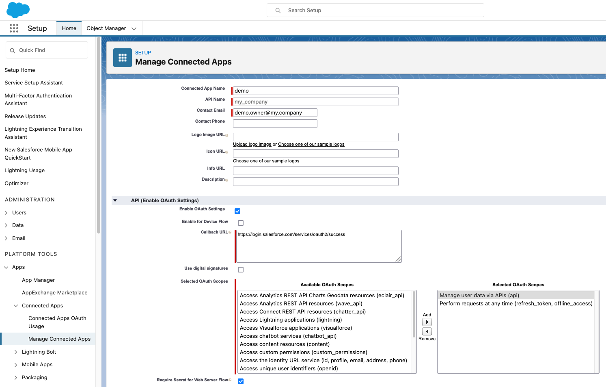

# Conduit Connector Salesforce

## General

The Salesforce plugin is one of [Conduit](https://github.com/ConduitIO/conduit) plugins.
It currently provides only source Salesforce connector, allowing for receiving Salesforce changes events in a Conduit pipeline.

## How to build it

Run `make`.

## Source

The Source connector subscribes to Salesforce platform events and queries published events in real time.

### How it works

This section describes the technical details of how the connector works.

#### Authentication

The connector authenticates with Salesforce using OAuth credentials. Once successfully authenticated, Salesforce returns:
- `Client ID` - token used in Streaming API requests.
- `Instance URL` - Streaming API base URL for given credentials.

#### Streaming API

Salesforce uses [CometD](https://docs.cometd.org/current7/reference/#_preface) as a streaming protocol. More details can be found in link below and in References:
https://developer.salesforce.com/docs/atlas.en-us.api_streaming.meta/api_streaming/using_streaming_api_client_connection.htm

#### Push Topic events

Connector is capable of listening to [custom Push Topics](https://developer.salesforce.com/docs/atlas.en-us.api_streaming.meta/api_streaming/code_sample_interactive_vfp_create_pushtopic.htm). These are topics created by the user where user specifies in what object's data (e.g. Id, Name, Title) and for which action (e.g. Update, Delete) is interested in.
List of all supported objects can be found here: https://developer.salesforce.com/docs/atlas.en-us.api_streaming.meta/api_streaming/supported_soql.htm.
All types of notifications are supported: `NotifyForOperationCreate`, `NotifyForOperationUpdate`, `NotifyForOperationUndelete`, `NotifyForOperationDelete`.
For more information about how to create Push Topics go to step-by-step configuration section.

##### The generated payload

Connector produces [`sdk.StructuredData`](https://github.com/ConduitIO/conduit-connector-sdk/blob/main/record.go) data type with information from the received event. The payload entirely depends on the Push Topic's query.
The following data is included:
- `Key` - either `nil` when not configured or the value of payload's `keyField` field.
- `Payload` - Salesforce Push Topic query result; a decoded JSON value.
- `Position` - Event's Replay ID, generated by Salesforce.
- `CreatedAt` - Event's Creation Date, generated by Salesforce.
- `Metadata.channel` - A channel name of the event.
- `Metadata.replyId` - Event's Replay ID.
- `Metadata.action` - Event's action, i.e. the reason why notification was sent (e.g.: `created`, `deleted`).

#### Change Data Capture events

Currently, connector does not support [Change Data Capture](https://developer.salesforce.com/docs/atlas.en-us.change_data_capture.meta/change_data_capture/cdc_subscribe_channels.htm) events.

#### Error handling

The connector will report any error at a startup in case any of auth credentials is incorrect and caused server to reject request.
Moreover, when any of provided Push Topic does not exist, Salesforce will reject its subscription, and it will also cause connector to fail.
Also, when `keyField` is configured but could not be found in data, error will be returned.
There may be need to reconnect while connector is working. Server returns conditions how to reconnect, but may also terminate the connection. Such cases are also handled and connector tries to reconnect or reports the termination to the user.

### Configuration Options

## Destination 

| name              | description                                                                                                                                                                                                                                    | required | default |
|-------------------|------------------------------------------------------------------------------------------------------------------------------------------------------------------------------------------------------------------------------------------------|----------|---------|
| `environment`     | Authorization service based on Organization’s Domain Name (e.g.: https://MyDomainName.my.salesforce.com -> `MyDomainName`) or `sandbox` for test environment.                                                                                  | `true`   |         |
| `clientId`        | OAuth Client ID (Consumer Key).                                                                                                                                                                                                                | `true`   |         |
| `clientSecret`    | OAuth Client Secret (Consumer Secret).                                                                                                                                                                                                         | `true`   |         |
| `username`        | Username.                                                                                                                                                                                                                                      | `true`   |         |
| `password`        | Password.                                                                                                                                                                                                                                      | `true`   |         |
| `securityToken`   | Security token as described here: https://help.salesforce.com/s/articleView?id=sf.user_security_token.htm&type=5.                                                                                                                              | `false`  |         |
| `pushTopicsNames` | The comma-separated list of names of the Push Topics to listen to. All values will be prefixed with `/topic/`. All values will have white spaces trimmed. Any empty value is skipped. All Topics have to exist for connector to start working. | `true`   |         |
| `keyField`        | The name of the Response's field that should be used as a Payload's Key. Empty value will set it to `nil`.                                                                                                                                     | `false`  | `"Id"`  |

## Source

| name              | description                                                                                                                                                                                                                                    | required | default |
|-------------------|------------------------------------------------------------------------------------------------------------------------------------------------------------------------------------------------------------------------------------------------|----------|---------|
| `oauthEndpoint`     | Authorization service based on Organization’s Domain Name (e.g.: https://MyDomainName.my.salesforce.com ) |   | `true`  |
| `clientId`        | OAuth Client ID (Consumer Key)           | `true`   |         |
| `clientSecret`    | OAuth Client Secret (Consumer Secret)      | `true`   |         |
| `username`        | Username.  | `true`   |         |
| `topicName` | Event topic name for your event (e.g: /event/Accepted_Quote__e)   | `true`   |         |

### Step-by-step configuration example

## Destination

There are a couple of steps that need to be done to start working with Salesforce connector as destination.

1. Log in into Your Salesforce account, e.g. https://my-demo-app.my.salesforce.com. The environment is `my-demo-app`.
2. First, if not already done, You need to create connected app and enable OAuth: [Enable OAuth Settings for API Integration](https://help.salesforce.com/s/articleView?id=sf.connected_app_create_api_integration.htm&type=5).

    The callback URL is required, but not relevant for this connector, so you can put anything there.

    Successfully configured app example can be seen below:

    
3. Copy **Consumer Key** and **Consumer Secret**. If You need these values once again You can always find them in _Setup -> Apps -> App Manager_, find app on the list and choose _View_ option.
    
4. You may need to configure **Security Token** for Your account. For more details follow instructions: [Reset Your Security Token](https://help.salesforce.com/s/articleView?id=sf.user_security_token.htm&type=5).
5. When all credentials are done, next You need to [create push topics](https://developer.salesforce.com/docs/atlas.en-us.api_streaming.meta/api_streaming/code_sample_interactive_vfp_create_pushtopic.htm).
    Configure topics to Your needs specifying query and notifications behaviour for them.
6. Once done, You can begin with configuring the connector:
   1. Use Step 1 environment value as `environment` config, e.g. `my-demo-app`.
   2. Use Step 3 **Consumer Key** value as `clientId` config.
   3. Use Step 3 **Consumer Secret** value as `clientSecret` config.
   4. Use Step 1 username and password credentials as values for `username` and `password` config.
   5. If required for Your account, use Step 4 **Security Token** value as `securityToken` config.
   6. Use Step 5 Topic Names as a comma-separated values for `pushTopicsNames` config, e.g. `TaskUpdates,ContactUpdates`.
   7. Optionally, configure `keyField`. The field's with this name value will be used as a Record Key, which may be utilized by other connectors.

        Example:

        When Push Topic query is: `SELECT Id, Name FROM Task` and `keyField` is set to **Id**,

        Then for event with value `Id=123, Name=Create summary` Record's Key will be set to `123`.

        Later, this may be utilized by other connectors, e.g. [Elasticsearch connector](https://github.com/conduitio-labs/conduit-connector-elasticsearch) will create Document with ID of Record's Key when available.

## Source 

1. Log in into Your Salesforce account, e.g. https://my-demo-app.my.salesforce.com. The environment is `my-demo-app`.
2. First, if not already done, You need to create connected app and enable OAuth: [Enable OAuth Settings for API Integration](https://help.salesforce.com/s/articleView?id=sf.connected_app_create_api_integration.htm&type=5).

    The callback URL is required, but not relevant for this connector, so you can put anything there.

    Successfully configured app example can be seen below:

    
3. Copy **Consumer Key** and **Consumer Secret**. If You need these values once again You can always find them in _Setup -> Apps -> App Manager_, find app on the list and choose _View_ option.
    

4. You will need to set following settings on the application, refer to  . 
    Make sure the user you are attaching to the application has "API ENABLED" permission set on their account. 

5. Set up event: 

## Testing

Run `make test` to run all the unit and integration tests.

## References

- https://developer.salesforce.com/docs/apis#browse
- https://developer.salesforce.com/docs/atlas.en-us.api_streaming.meta/api_streaming/intro_stream.htm
- https://docs.cometd.org/current7/reference/#_concepts
